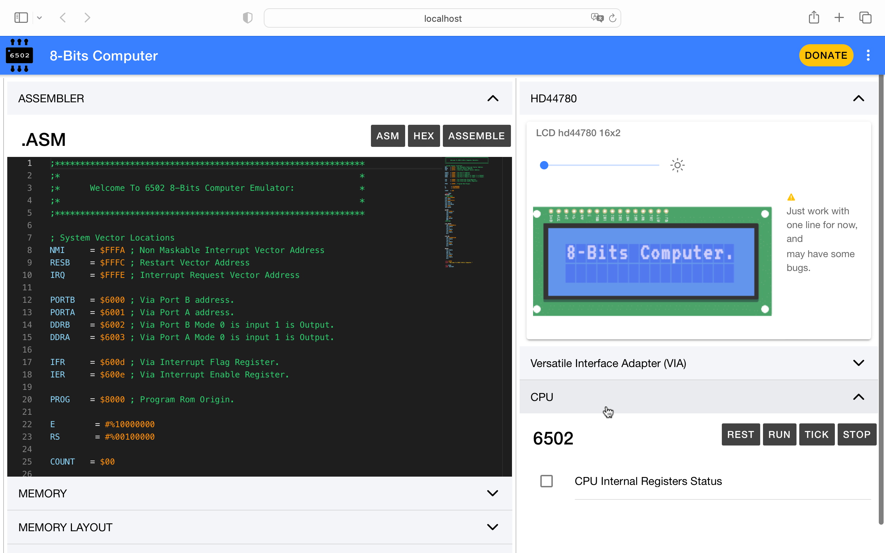

# 6502 8-Bits Based Computer



## What
Emulation of a simple 8-Bits computer based on the famous 6502 chip, it supports all documented opcodes even interrupts like NMI and IRQ. Inspired in the Ben Eater 6502 YouTube Serie:
 https://www.youtube.com/watch?v=LnzuMJLZRdU&list=PLowKtXNTBypFbtuVMUVXNR0z1mu7dp7eH

The 6502 code is a port to typescript from the javidx9 C++ NES Emulator YouTube Serie.
https://www.youtube.com/watch?v=8XmxKPJDGU0

The assembler code is a port to typescript from the NesHacker 6502 Repo wich has been extended with extra commands to suport label address at compile time.
https://github.com/NesHacker/6502

## Commands

#### `.org`
This command set the absolute program address at the point of invocation. It is
useful for defining patch segements for ROM hacks.
```
; Set the absolute program offset to $8000
.org $8000
```
#### `.addr`
This command set the absolute program address of a label.
Useful for defining label address.
```
.addr my_label    ; Place the address of my_label
```

#### `.word`
This defines 2 bytes to be processed by the assembler. Useful
for defining configuration bytes or some address.
```
.word $FFFC     ; Literal 2 bytes: $FF, $FC
```

#### `.byte` or `.byt`
This defines a run of arbitrary bytes to be processed by the assembler. Useful
for defining lookup tables or text segments.

```
.byte 16, 32, 64   ; Literal bytes: $10, $20, $40
.byte "Hello"      ; Literal bytes: $48, $65, 6C, $6C, $6F
```

## Memory Layout

There is 64KB of memory and this is broken into 

0x0000 - 0x00FF - Free (Zero Page)

0x00FE - 0x00FE - Random Value Buffer

0x0100 - 0x01FF - Stack

0x0200 - 0x5FFF - Free

0x6000 - 0x6FFF - VIA - Versatile Interface Adapter

0x7000 - 0x8000 - Free

0x8000 - 0xFFF9 - Program - always make sure to assemble programs for this address

0xFFFA - 0xFFFA - NMI - Non-Maskable Interrupt Vector Location

0xFFFA - 0xFFFC - RESB - Reset Vector Location

0xFFFA - 0xFFFE - IRQB - Interrupt Request Vector Location

## Code Examples

Infinte Count:


Shift Left With Interrupt:


``

## Installation
Download or clone repository.


#### Install Angular Cli
```javascript
    npm install -g @angular/cli
```

#### Clone
`git clone https://github.com/blackshark537/6502.git`

#### NPM
```javascript
npm i --save
```

### Build
```javascript
ng build
```

### Running
```javascript
ng serve
```

## License

Licensed under the [MIT](LICENSE) License.